# Hi, I'm Sam 👋

## Senior Smart Contract Engineer · Solidity · Web3 · EVM

📍 Montreux, Switzerland &nbsp;·&nbsp; Lead Blockchain Engineer [@SmarDex](https://smardex.io) (rebranding to [Everything](https://everything.inc))

---

## 🔭 What I do

I architect and ship production **DeFi protocols** end-to-end — research, specification, implementation, audit coordination, and multi-chain deployment.

- 🔐 **$40M+ TVL** secured across **~20k CLOC** of Solidity on **5 EVM chains** — Ethereum · Arbitrum · Base · BNB Chain · Polygon
- 🧱 Shipped AMMs, yield-bearing stablecoins, lending & leverage protocols, staking systems, and a fully on-chain lottery
- 🛡️ **7 third-party audits** handled end-to-end, backed by deep fuzzing & invariant testing
- 🌱 Currently leveling up in **Rust**

## 🚀 Protocols I've shipped

| Protocol | What it is | Link |
|---|---|---|
| **SmarDex** | An AMM engineered to minimize impermanent loss | [smardex.io](https://smardex.io) |
| **USDN** | Yield-bearing synthetic dollar on a delta-neutral leverage protocol | [smardex.io/usdn](https://smardex.io/usdn) |
| **Everything** | All-in-one protocol: trading, lending & leverage in a single pool | [everything.inc](https://everything.inc) |
| **B-Lucky** | A fully on-chain decentralized lottery | [b-lucky.gg](https://b-lucky.gg) |

## 🏆 Hackathons & milestones

- 🥇 **1st place** — Ledger × 42 (Binance-sponsored)
- 🏊 **Pool Prize** — Polygon BUIDL IT · [Devpost](https://devpost.com/software/pocket-dtvhr0)
- 🏅 **Best Use of XMTP** + Airstack Runner-Up — ETHGlobal · [Showcase](https://ethglobal.com/showcase/funnel-z8f80)
- 💡 Co-founded **GoPocket** out of a hackathon win (€400k seed — Fabric Ventures & FRST)

## 🛠️ Tech stack

**Smart contracts & EVM**

**Security & testing**

**Languages**

**Frontend & Web3**

**Tooling**

## 📊 GitHub

